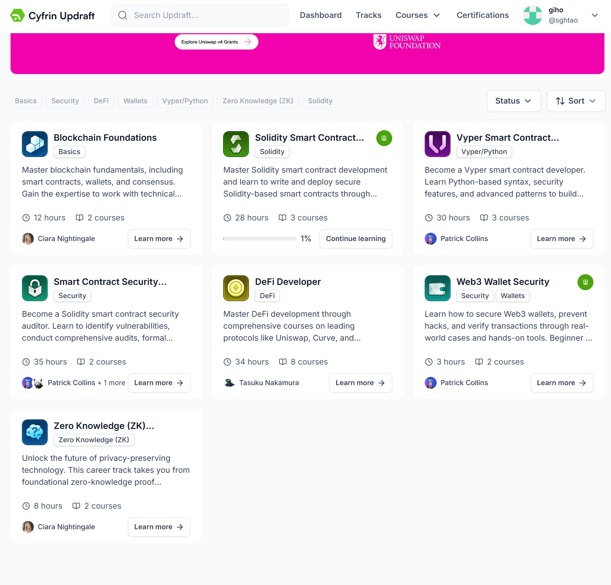
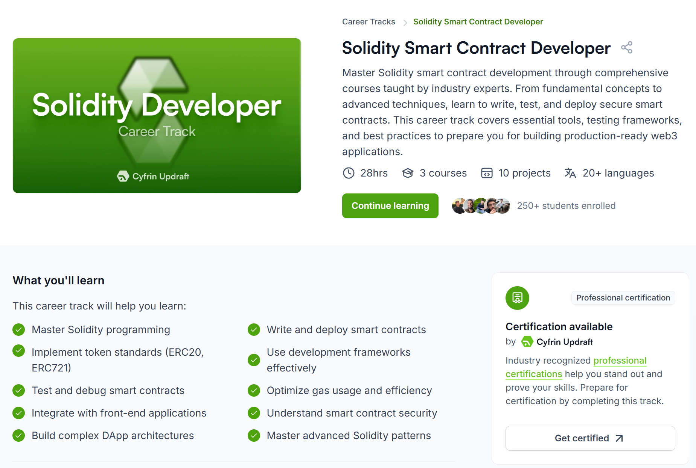

Cyfrin Updraft라는 Web3, 블록체인 교육 플랫폼에서 개발 공부를 시작하려 한다.

블록체인 기초부터, 솔리디티, DeFI 등 다양한 트랙이 있으며, 나는 Solidity Smart Contract Developer 트랙을 선택한다.

이 트랙을 따르면, Solidity와 Foundry를 배울 수 있어 이 트랙을 선정했다. 나의 전공인 데이터사이언스와 블록체인이 만나는 지점이 내가 가야할 길이자, 나만의 강점과 색을 갖는 길이라고 생각했다. 
그래서 나는 온체인 데이터 분석이 가능한 블록체인 개발자, 혹은 블록체인 개발이 가능한 온체인 분석가가 되면 좋겠다는 생각을 했다.
온체인 데이터 분석에 대해서는 이와 같이 병행하여 공부할 계획이고, 블록체인 개발에 대해서는 이 트랙을 통해 공부할 예정이다.
솔리디티는 가장 널리 쓰이는 스마트 컨트랙트 프로그래밍 언어이다. 

퀴즈 내용
EVM 기반 스마트 컨트랙트에 가장 널리 사용되는 프로그래밍 언어는 솔리디티이다.
pragma라는 키워드의 역할은 사용되어야하는 솔리디티 컴파일러의 버전을 명시하는 것이다. (pragma solidity 0.8.33;)
contract를 complie한다는 것은 솔리디티 코드를 EVM이 이해하고 실행할 수 있는 bytecode와 ABI로 변환하는 것을 의미한다.